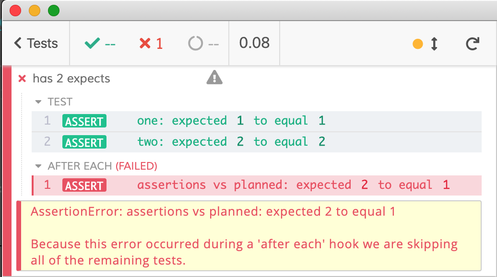
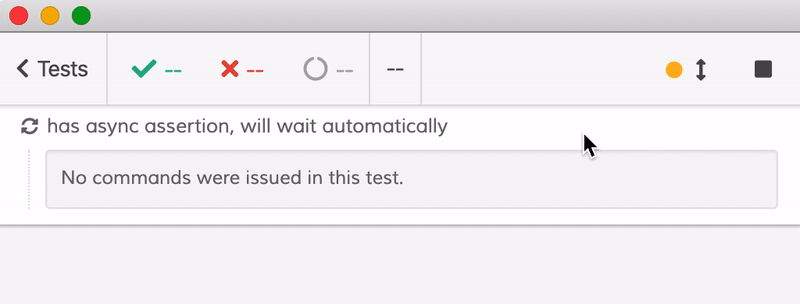
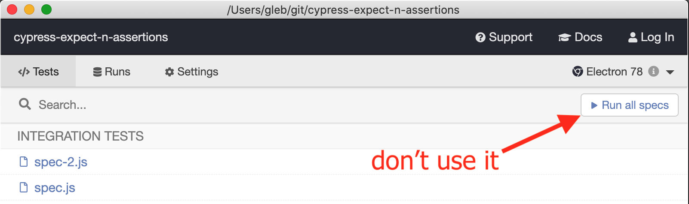

# cypress-expect-n-assertions [![renovate-app badge][renovate-badge]][renovate-app] [](https://circleci.com/gh/bahmutov/cypress-expect-n-assertions/tree/master)
> Cypress helper that checks number of expected and actual assertions in the test

## Example

```js
const {plan} = require('cypress-expect-n-assertions')
it('has 2 expects', () => {
  plan(2)
  expect(1, 'one').to.equal(1)
  expect(2, 'two').to.equal(2)
})
```

If the test for some reason runs a different number of assertions, the test will fail using `afterEach` hook. Same test, but with a wrong `plan` argument generates a failure

```js
const {plan} = require('cypress-expect-n-assertions')
it('has 2 expects', () => {
  plan(1) // wrong value on purpose
  expect(1, 'one').to.equal(1)
  expect(2, 'two').to.equal(2)
})
```



The `afterEach` hook used in this module **will automatically wait** if the number of assertions is below the plan. For example, the following test executes the second assertion asynchronously after 2 second delay

```js
it('has async assertion, will wait automatically', () => {
  plan(2)
  expect(1, 'one').to.equal(1)
  setTimeout(() => {
    expect(2, 'two').to.equal(2)
  }, 2000)
})
```

The video below shows how the test automatically waits (up to `defaultCommandTimeout`) for the "missing" assertion to happen.



## Limitations

To avoid multiple mocking of `expect`, for now you can only run individual spec files. Do not use "Run all specs" button.



### Small print

Author: Gleb Bahmutov &copy; 2020

* [@bahmutov](https://twitter.com/bahmutov)
* [glebbahmutov.com](https://glebbahmutov.com)
* [blog](https://glebbahmutov.com/blog/)

License: MIT - do anything with the code, but don't blame me if it does not work.

Spread the word: tweet, star on github, etc.

Support: if you find any problems with this module, email / tweet / open an issue on Github

[issues]: https://github.com/bahmutov/rocha/issues

## MIT License

Copyright (c) 2020 Gleb Bahmutov

Permission is hereby granted, free of charge, to any person
obtaining a copy of this software and associated documentation
files (the "Software"), to deal in the Software without
restriction, including without limitation the rights to use,
copy, modify, merge, publish, distribute, sublicense, and/or sell
copies of the Software, and to permit persons to whom the
Software is furnished to do so, subject to the following
conditions:

The above copyright notice and this permission notice shall be
included in all copies or substantial portions of the Software.

THE SOFTWARE IS PROVIDED "AS IS", WITHOUT WARRANTY OF ANY KIND,
EXPRESS OR IMPLIED, INCLUDING BUT NOT LIMITED TO THE WARRANTIES
OF MERCHANTABILITY, FITNESS FOR A PARTICULAR PURPOSE AND
NONINFRINGEMENT. IN NO EVENT SHALL THE AUTHORS OR COPYRIGHT
HOLDERS BE LIABLE FOR ANY CLAIM, DAMAGES OR OTHER LIABILITY,
WHETHER IN AN ACTION OF CONTRACT, TORT OR OTHERWISE, ARISING
FROM, OUT OF OR IN CONNECTION WITH THE SOFTWARE OR THE USE OR
OTHER DEALINGS IN THE SOFTWARE.

[renovate-badge]: https://img.shields.io/badge/renovate-app-blue.svg
[renovate-app]: https://renovateapp.com/
